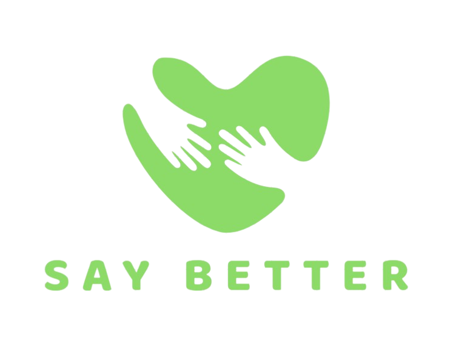

# 
Say Better

 

<h1 align="center">Say Better</h1>

 

Say Better is a solution that enables children with brain lesion disorders to receive speech therapy through pictorial symbols, contactlessly. Educators can get help from artificial intelligence in planning therapy sessions. Learners can continue to use the picture symbols they've been learning to communicate even after their contactless therapy schedule ends.

 

## Target SDGs
### Goal4: Quality Education

SDG Description

### Goal10: Reduced Inequalities

SDG Description

### 프로젝트 목표

## 프로젝트 참여자

|||||
|:-:|:-:|:-:|:-:|
|[지영인]()|[김태규]()|[이채원]()|[최선규]()|
|PM|ML Engineer|Front-End Engineer|Back-End Engineer|